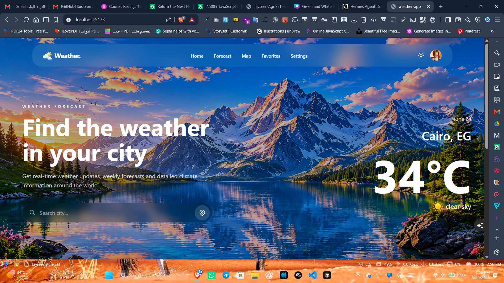
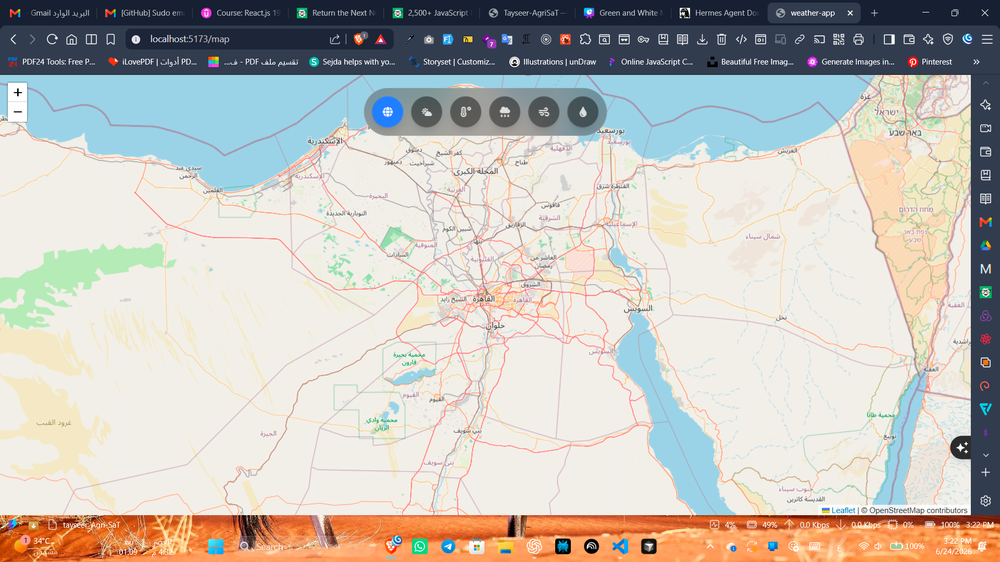

# 🌦️ Weather App

A modern and responsive weather application built with React and Vite. The app provides real-time weather conditions, hourly and weekly forecasts, and an interactive weather map powered by external weather APIs.


### Home Page



### Weather Map



---

## 🚀 Live Demo

[Live Demo](https://weather-app-nine-coral-27ql9sn36d.vercel.app/)

[Source Code](https://github.com/m-ibrahim-x/Weather-app)

---

## ✨ Features

- 🌤️ Real-time weather conditions
- 🌡️ Temperature, humidity, wind speed, and pressure details
- ⏰ Hourly weather forecast
- 📅 7-Day weather forecast
- 🗺️ Interactive weather map
- 🌍 Search weather by city
- 📱 Fully responsive design
- ⚠️ API error handling page
- 🚫 Custom 404 Not Found page

---

## 🛠️ Technologies Used

### Frontend

- React.js
- Vite
- Tailwind CSS
- React Router DOM
- React Hooks
- Custom Hooks

### APIs

- OpenWeatherMap API
- Open-Meteo API

### Libraries

- Axios
- React Leaflet
- React Icons
- Lucide React

---

## 📂 Project Structure

```bash
src
├── assets
│   ├── icons
│   ├── images
│   └── illustrations
│
├── components
│   ├── layout
│   ├── map
│   ├── ui
│   └── weather
│
├── hooks
│   └── useWeather.js
│
├── pages
│   ├── Home.jsx
│   ├── Map.jsx
│   └── error
│
├── services
│   └── WeatherApi.js
│
└── App.jsx
```
---

## 🏗️ Architecture

- WeatherApi.js → API requests
- useWeather.js → Weather logic and state management
- Home.jsx → UI rendering

---

## ⚙️ Installation

Clone the repository:

```bash
git clone https://github.com/m-ibrahim-x/Weather-app.git
```

Move into the project folder:

```bash
cd weather-app
```

Install dependencies:

```bash
npm install
```

Run the development server:

```bash
npm run dev
```

---

## 🔑 Environment Variables

Create a `.env` file in the root directory:

```env
VITE_WEATHER_API_KEY=your_openweathermap_api_key
```

---

## 📦 Build For Production

```bash
npm run build
```

Preview production build:

```bash
npm run preview
```

---

## 🐛 Troubleshooting

### API Errors

- Make sure your API key is valid.
- Verify that the `.env` file exists.
- Restart the development server after updating environment variables.

### Map Issues

- Ensure internet connectivity.
- Verify that weather layers are enabled correctly.

---

## 🤝 Contributing

Contributions, issues, and feature requests are welcome.

Feel free to fork this repository and submit a pull request.

---

## 📄 License

This project is licensed under the MIT License.

---

## 👨‍💻 Author

Developed by Mohamed Ibrahim using React, Vite, Tailwind CSS, and OpenWeatherMap APIs.
